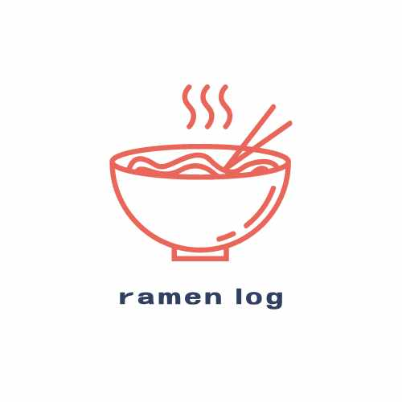

# ポートフォリオ

## サービス名：　[ramen-log](https://sheltered-beyond-46739.herokuapp.com/)

## ■　サービス概要
　記録したラーメン情報を投稿・共有できるサービスです。

### 機能
  - 検索機能
  - 投稿機能
  - ユーザー認証機能
  - 画像投稿機能

### 開発環境
  - Laravel sail

#### バックエンド
- PHP8.1.18
- Laravel 10.8.0

#### フロントエンド
- CSSフレームワーク
  - Tailwind css

#### インフラ
- Heroku
- mysql(データベース)